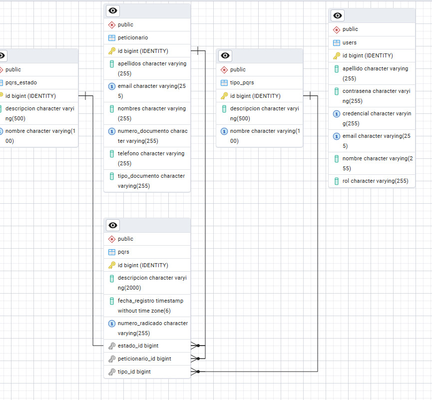

# Sistema PQRS - Peticiones, Quejas, Reclamos y Sugerencias

Sistema web para la gestión y seguimiento de solicitudes PQRS (Peticiones, Quejas, Reclamos y Sugerencias).

## Estructura del Proyecto

```
pqrs_back/    # Backend (Spring Boot, Java)
pqrs_front/   # Frontend (HTML, JS, TailwindCSS)
.vscode/      # Configuración de VS Code
.idea/        # Configuración de IntelliJ IDEA
README.md     # Este archivo
```

### Estructura de carpetas en `src`

#### Backend (`pqrs_back/src/main/java`)
- **controller/**: Controladores REST para manejar las solicitudes HTTP.
- **model/**: Entidades y modelos de datos.
- **repository/**: Interfaces para acceso a datos y persistencia (JPA).
- **service/**: Lógica de negocio y servicios.
- **security/**: Configuración de seguridad, JWT y autenticación.
- **dto/**: Objetos de transferencia de datos entre capas.
- **exception/**: Manejo de excepciones personalizadas.

#### Frontend (`pqrs_front/src`)
- **assets/**: Imágenes, íconos y recursos estáticos.
- **components/**: Componentes reutilizables de la interfaz.
- **pages/**: Vistas principales del sistema (dashboard, reportes, login, etc).
- **styles/**: Archivos CSS y configuración de Tailwind.
- **utils/**: Funciones auxiliares y utilidades.
- **services/**: Lógica para consumir APIs y manejar datos.
- **tests/**: Pruebas unitarias y de integración del frontend.

---

## Características

- Registro y autenticación de usuarios
- Envío y gestión de solicitudes PQRS
- Consulta y cambio de estado por número de radicado o ID
- Panel de administración y reportes dinámicos
- Gestión de usuarios y roles
- Estadísticas, métricas y tiempos de respuesta
- Notificaciones automáticas y actualizadas en tiempo real
- Buscador avanzado en dashboard y reportes (por palabras, mayúsculas/minúsculas, tildes)
- Visualización gráfica interactiva de métricas

---

## Tecnologías

- **Backend:** Java, Spring Boot, JPA, JWT, PostgreSQL, Thymeleaf
- **Frontend:** HTML, JavaScript, TailwindCSS, Chart.js

---

## Instalación

### Backend

1. Ve a la carpeta `pqrs_back`
2. Instala dependencias y ejecuta el proyecto:
    ```sh
    ./mvnw spring-boot:run
    ```
3. Configura la base de datos en `application.properties` si es necesario.

### Frontend

1. Ve a la carpeta `pqrs_front/src`
2. Abre los archivos HTML en tu navegador o sirve la carpeta con un servidor estático.

---

## Pruebas (Tests)

### Backend

- Las pruebas unitarias y de integración están implementadas usando JUnit y Spring Boot Test.
- Para ejecutar los tests del backend, usa el siguiente comando en la carpeta `pqrs_back`:
    ```sh
    ./mvnw test
    ```
- Los resultados de las pruebas se mostrarán en la consola y se pueden consultar en la carpeta `target/surefire-reports`.

#### Pruebas unitarias (`pqrs_back/src/test/java/com/ideapro/pqrs_back/aplication`)
Esta carpeta contiene los archivos de pruebas unitarias para las entidades principales del backend:

- **PeticionarioTest.java**: Verifica la lógica y validaciones de la entidad Peticionario, asegurando que los datos del usuario que presenta PQRS sean correctos.
- **PqrsTest.java**: Comprueba la funcionalidad de la entidad PQRS, como la creación de solicitudes, el cambio de estado y las reglas de negocio asociadas.
- **UserTest.java**: Evalúa la gestión de usuarios, autenticación y roles, garantizando la seguridad y el correcto funcionamiento del sistema de usuarios.

Estas pruebas ayudan a detectar errores y asegurar la calidad del código en el backend.


## Lógica del Proyecto

### Backend

El backend está desarrollado con Spring Boot y sigue una arquitectura modular y escalable.  
La lógica principal se organiza en capas para facilitar el mantenimiento y la extensión del sistema:

- **Controladores (controller):** Reciben las solicitudes HTTP, validan los datos y delegan la lógica a los servicios. Cada controlador corresponde a una entidad o funcionalidad principal (PQRS, usuarios, estados, autenticación).
- **Servicios (service):** Implementan la lógica de negocio, procesan los datos y coordinan las operaciones entre entidades y repositorios. Aquí se gestionan reglas como el cambio de estado, envío de notificaciones, validaciones y cálculos de métricas.
- **Repositorios (repository):** Encapsulan el acceso a la base de datos usando JPA. Permiten realizar consultas, guardar, actualizar y eliminar entidades.
- **Modelos (model):** Representan las entidades del sistema (PQRS, Usuario, Estado, Peticionario, etc.) y definen sus atributos y relaciones.
- **Seguridad (security, auth):** Gestiona la autenticación y autorización de usuarios mediante JWT y Spring Security. Controla el acceso a los endpoints según roles y permisos.
- **DTOs (dto):** Facilitan la transferencia de datos entre el backend y el frontend, evitando exponer directamente las entidades.
- **Excepciones (exception):** Manejan errores personalizados y respuestas claras ante fallos en las operaciones.
- **Notificaciones:** El sistema calcula y envía notificaciones automáticas sobre nuevas PQRS y solicitudes próximas a vencer, tanto por correo electrónico como en el dashboard.
- **Reportes y métricas:** Existen endpoints dedicados para obtener estadísticas, métricas y reportes dinámicos sobre el estado y gestión de las PQRS.

Esta estructura permite que cada funcionalidad esté bien separada y sea fácilmente testeable, escalable y mantenible.

### Frontend
- **Dashboard:** Visualización de PQRS, cambio de estado, notificaciones en tiempo real, buscador avanzado.
- **Reportes:** Gráficos interactivos de métricas, filtrado dinámico por palabras, leyendas coloridas y animaciones.
- **Buscador:** Búsqueda por palabras completas, mayúsculas/minúsculas y tildes en dashboard y reportes.
- **Notificaciones:** Actualización automática al cambiar estados o recibir nuevas PQRS.
- **Interfaz:** Diseño responsivo y moderno con TailwindCSS.


### Backend: Descripción de carpetas principales

- **auth/**: Lógica de autenticación y autorización, manejo de JWT y seguridad de usuarios.
- **config/**: Archivos de configuración general del proyecto (seguridad, CORS, beans, etc).
- **controller/**: Controladores REST que gestionan las rutas y peticiones HTTP.
- **peticionario/**: Funcionalidad y modelos relacionados con los usuarios que presentan PQRS.
- **pqrs/**: Lógica, modelos y servicios específicos para la gestión de solicitudes PQRS.
- **service/**: Servicios que contienen la lógica de negocio y operaciones sobre los datos.
- **user/**: Gestión de usuarios, roles y sus operaciones asociadas.

### Vistas HTML (`pqrs_back/src/main/resources/templates`)
- **consultar.html**: Página para consultar el estado de una solicitud PQRS por número de radicado o documento.
- **dashboard.html**: Panel principal para administración y visualización de métricas, reportes y gestión de PQRS.
- **formulario.html**: Formulario para registrar una nueva solicitud PQRS.
- **index.html**: Página de inicio del sistema.
- **login.html**: Vista para autenticación de usuarios.
- **register.html**: Vista para registro de nuevos usuarios.
- **reportes.html**: Página para visualizar reportes y estadísticas de PQRS.
- **fragments/**: Carpeta con fragmentos HTML reutilizables (por ejemplo, menús, encabezados, pie de página) para ser incluidos en otras vistas.

---

## Endpoints Principales

### PQRS
- **POST /api/pqrs**: Crea una nueva PQRS.
- **GET /api/pqrs**: Lista todas las PQRS.
- **GET /api/pqrs/{id}**: Obtiene una PQRS por su ID.
- **GET /api/pqrs/buscarPorRadicado/{numeroRadicado}**: Busca PQRS por número de radicado.
- **GET /api/pqrs/buscarPorDocumento/{numeroDocumento}**: Busca PQRS por número de documento.
- **DELETE /api/pqrs/eliminar/{id}**: Elimina una PQRS por su ID.
- **GET /api/pqrs/total**: Devuelve el número total de PQRS.
- **GET /api/pqrs/estado/{id}**: Devuelve el estado de una PQRS por ID.
- **GET /api/pqrs/estado/radicado/{numeroRadicado}**: Devuelve el estado por número de radicado.
- **GET /api/pqrs/porEstado/{estado}**: Lista PQRS por estado.
- **GET /api/pqrs/historial**: Devuelve el historial de PQRS.
- **GET /api/pqrs/notificaciones**: Devuelve notificaciones de PQRS (nuevas y próximas a vencer).
- **PATCH /api/pqrs/{id}/estado**: Cambia el estado de una PQRS por ID.
- **PATCH /api/pqrs/estado/radicado/{numeroRadicado}**: Cambia el estado por número de radicado.

### Estados PQRS
- **POST /api/estados**: Crea un nuevo estado.
- **GET /api/estados**: Lista todos los estados.
- **GET /api/estados/{id}**: Busca estado por ID.
- **GET /api/estados/buscar/{nombre}**: Busca estado por nombre.
- **PUT /api/estados/{id}**: Actualiza estado por ID.
- **DELETE /api/estados/{id}**: Elimina estado por ID.

---

## Esquema de la Base de Datos



---

## Uso

- Accede a la página principal para enviar PQRS o consultar estado.
- Los administradores pueden acceder al dashboard y reportes.
- El sistema notifica por correo electrónico el estado de la solicitud.
- El dashboard y reportes se actualizan automáticamente y permiten búsquedas avanzadas.

---

## Información adicional y recomendaciones

### Requisitos previos

- Java 17+
- Maven 3.8+
- Node.js 18+
- PostgreSQL 13+
- Navegador moderno (Chrome, Firefox, Edge)

### Configuración de variables de entorno

- Claves JWT (`jwt.secret`)
- Datos de conexión a la base de datos (`spring.datasource.*`)
- Parámetros de correo electrónico para notificaciones
- Variables en archivos `.env` para frontend y backend

### Documentación de roles y permisos

| Rol         | Permisos principales                                      |
|-------------|----------------------------------------------------------|
| Administrador | Acceso total, gestión de usuarios, reportes, estados    |
| Usuario      | Crear y consultar PQRS propias, recibir notificaciones   |
| Peticionario | Registrar PQRS, consultar estado                         |


## Licencia

Este proyecto está bajo la licencia Apache 2.0.

---
